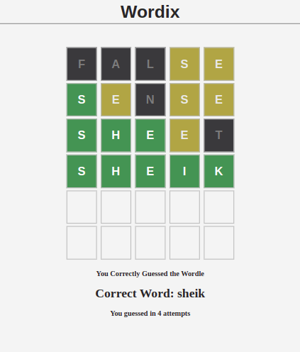

# Wordix

This is a game based on New York Times' Wordle.

You need to guess the word in six tries:

- Each guess must be a valid five-letter word. Hit the enter button to submit.
- After each guess, the color of the tiles will change to show how close your guess was to the word.

### Examples:
- The tile will be GREEN if the letter is in the word and in the correct spot.
- The tile will be YELLOW if the letter is in the word but in the wrong spot.
- The tile will be GRAY if the letter is not in the word in any spot.

Developed using ReactJS. It was a challenging project because of the logical complexity to set up the board, the keyboard, and check it against the word selected by the program.

For development, I used the Context API and Hooks for state management, as well as logical operations and loops to manage the data in arrays and strings.

This project was bootstrapped with [Create React App](https://github.com/facebook/create-react-app).

## Available Scripts

In the project directory, you can run:

### `npm start`

Runs the app in the development mode.\
Open [http://localhost:3000](http://localhost:3000) to view it in your browser.

The page will reload when you make changes.\
You may also see any lint errors in the console.

### `npm run build`

Builds the app for production to the `build` folder.\
It correctly bundles React in production mode and optimizes the build for the best performance.

The build is minified and the filenames include the hashes.\
Your app is ready to be deployed!

See the section about [deployment](https://facebook.github.io/create-react-app/docs/deployment) for more information.

